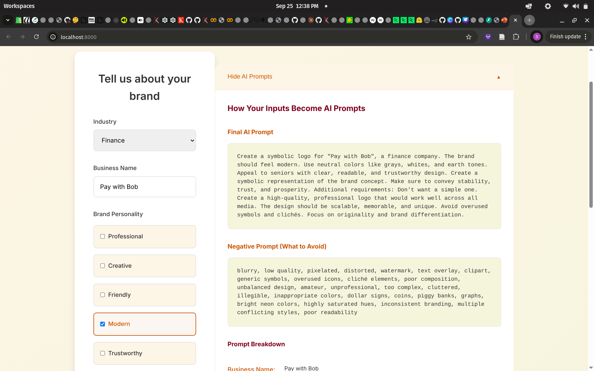
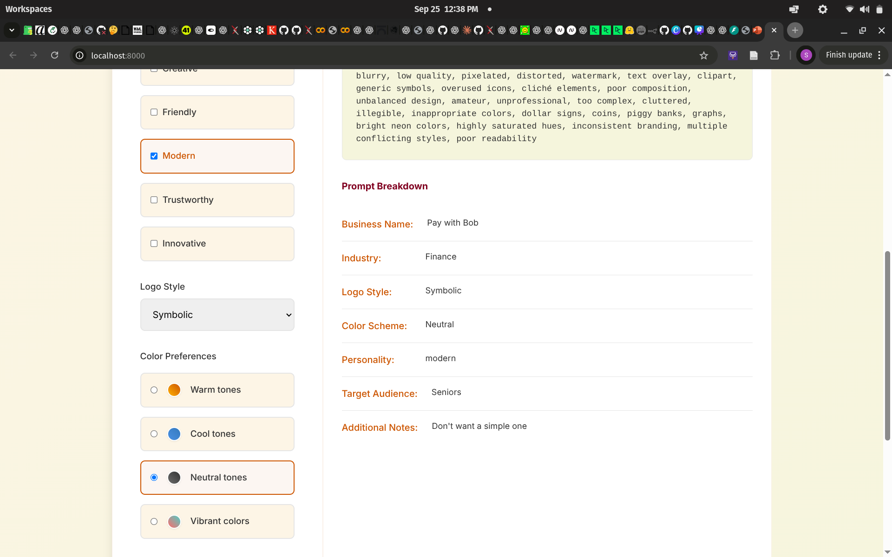
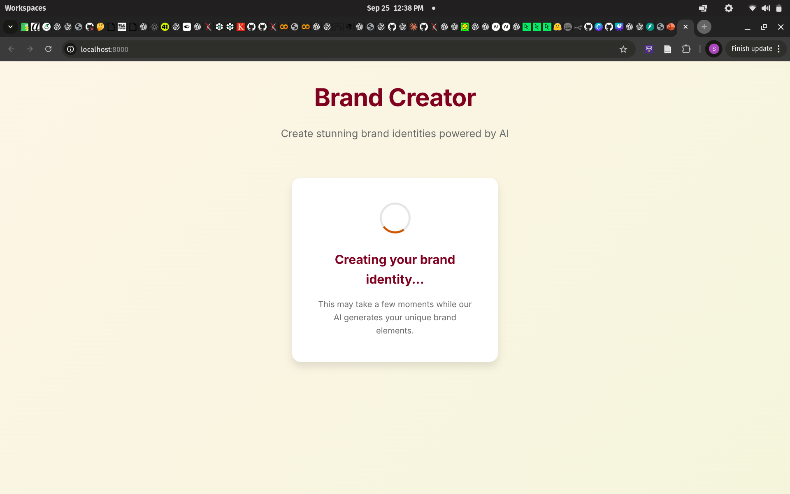
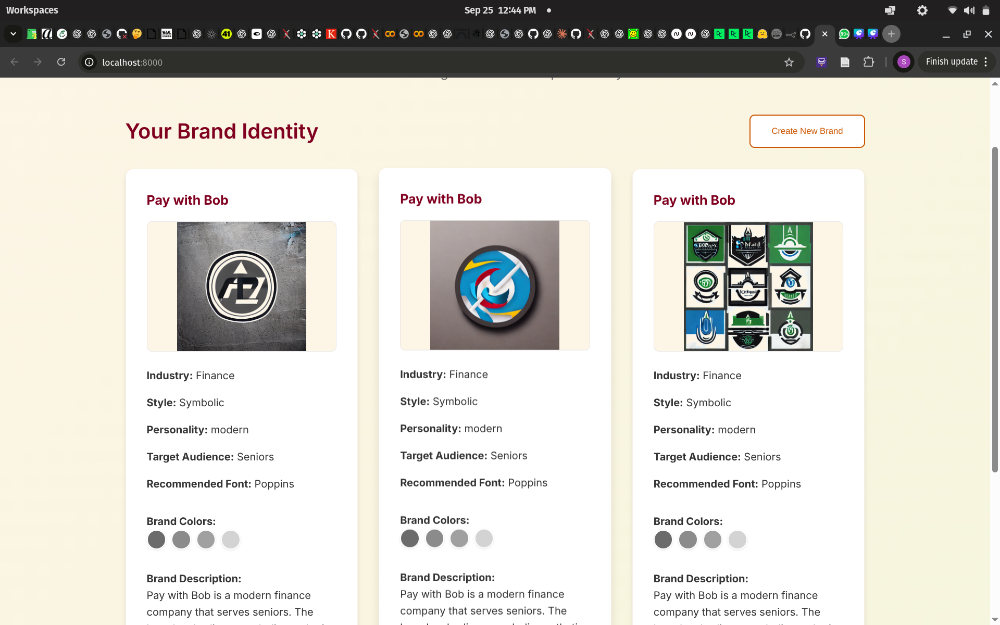

# AI Brand Creator - Frontend Implementation

A minimalist web application for AI-powered brand creation featuring intelligent form interfaces, real-time prompt generation, and Stable Diffusion integration.

## Overview

This application provides a complete solution for generating professional brand identities using artificial intelligence. The system transforms user-friendly form inputs into sophisticated AI prompts, generates logos with Stable Diffusion, and presents results in a clean, fall-themed interface.

## Features

### Core Functionality
- **Intelligent Form Interface**: User-friendly inputs that automatically generate complex AI prompts
- **Stable Diffusion Integration**: Real-time logo generation using CPU-optimized Stable Diffusion v1.5
- **Brand Prompt Engineering**: Smart conversion of business attributes into optimized AI prompts
- **Logo Enhancement**: Automatic background removal, sharpening, and professional formatting
- **Explainability Interface**: Transparent view of how user inputs create AI prompts

### Technical Architecture
- **Frontend**: Vanilla JavaScript with fall-themed responsive design
- **Backend**: FastAPI with async processing and comprehensive error handling
- **AI Models**: Stable Diffusion v1.5 with CPU optimizations
- **Storage**: Structured file system for generated assets
- **API Design**: RESTful endpoints with Pydantic validation

## Screenshots

### Main Interface

*Clean, minimalist form interface with fall color theme*

### Intelligent Form Controls

*Industry selection, personality traits, and style preferences*

### Color Scheme Selection

*Visual color scheme selection with sample previews*

### AI Prompt Explainability

*Real-time display of generated AI prompts with breakdown*

### Generated Results

*Professional display of AI-generated logos with brand information*

## Installation and Setup

### Prerequisites
- Python 3.8 or higher
- 8GB+ RAM (recommended for Stable Diffusion)
- 10GB+ free disk space (for model downloads)

### Quick Start

1. **Clone the Repository**
   ```bash
   git clone https://github.com/its-serah/AI-Brand-Creator.git
   cd AI-Brand-Creator/01-mvp-monolith
   ```

2. **Install Dependencies**
   ```bash
   pip install -r requirements.txt
   ```

3. **Start the Application**
   ```bash
   python3 server.py
   ```

4. **Access the Interface**
   - Frontend: http://localhost:8000
   - API Documentation: http://localhost:8000/docs
   - Health Status: http://localhost:8000/api/health

### First Run Notes
- Initial startup will download Stable Diffusion models (~4GB)
- First generation may take 5-10 minutes depending on system
- Subsequent generations are significantly faster

## Usage Guide

### Creating a Brand Identity

1. **Business Information**
   - Enter your business name
   - Select industry category
   - Define target audience

2. **Brand Personality**
   - Choose personality traits (professional, creative, modern, etc.)
   - Select logo style preference
   - Pick color scheme theme

3. **AI Generation**
   - Review auto-generated prompts in explainability section
   - Click "Create My Brand" to start generation
   - Wait for AI processing (2-5 minutes on CPU)

4. **Results Review**
   - View generated logo variations
   - Review color palette recommendations
   - Check typography suggestions
   - Read AI-generated brand description

### Understanding the Process

The application follows this workflow:

1. **Form Input Collection**: User selections gathered from interface
2. **Prompt Engineering**: Inputs transformed into specialized AI prompts
3. **AI Generation**: Stable Diffusion processes prompts into logo images
4. **Enhancement Pipeline**: Background removal, sharpening, format optimization
5. **Result Compilation**: Logos combined with color palettes and descriptions

## API Reference

### Brand Generation Endpoint
```
POST /api/v1/brand/generate
```

**Request Body:**
```json
{
  "business_name": "string",
  "industry": "technology|healthcare|finance|...",
  "style": "minimal|geometric|symbolic|...",
  "color_scheme": "warm|cool|neutral|vibrant",
  "personality_traits": ["professional", "modern"],
  "target_audience": "businesses|young-adults|...",
  "prompt": "generated_ai_prompt",
  "negative_prompt": "elements_to_avoid"
}
```

**Response:**
```json
{
  "job_id": "uuid",
  "business_name": "string",
  "status": "completed",
  "logos": [...],
  "color_palette": ["#color1", "#color2"],
  "font_suggestion": "font_name",
  "brand_description": "ai_generated_description",
  "processing_time_seconds": 2.14
}
```

### Additional Endpoints
- `GET /api/v1/brand/styles` - Available logo styles
- `GET /api/v1/brand/industries` - Supported industries  
- `GET /api/v1/brand/personalities` - Personality traits
- `GET /api/health/` - System health status

## Architecture Details

### Frontend Components
```
frontend/
├── index.html          # Main application interface
├── styles.css          # Fall-themed styling system
└── script.js           # Application logic and API integration
```

### Backend Services
```
api/
├── main.py            # FastAPI application entry point
├── config.py          # Environment configuration
├── models/            # Pydantic data models
├── routes/            # API endpoint definitions
└── services/          # Business logic and AI integration
```

### AI Integration Points

**Stable Diffusion Pipeline:**
- Model: `runwayml/stable-diffusion-v1-5`
- Optimizations: CPU offloading, attention slicing, memory efficiency
- Parameters: 15 inference steps, 7.5 guidance scale, 512x512 resolution

**Prompt Engineering:**
- Industry-specific terminology injection
- Style-aware modifier selection
- Personality trait integration
- Negative prompt generation for quality control

**Enhancement Pipeline:**
- Background removal via threshold detection
- Image sharpening with unsharp mask filter
- Format optimization for web display
- Base64 encoding for immediate preview

## Configuration Options

### Environment Variables
```bash
# AI Model Configuration
SD_MODEL_ID=runwayml/stable-diffusion-v1-5
DEVICE=cpu  # or cuda for GPU
INFERENCE_STEPS=15

# Storage Configuration  
STORAGE_DIR=./storage
LOGOS_DIR=./storage/logos

# API Configuration
API_HOST=0.0.0.0
API_PORT=8000
LOG_LEVEL=INFO
```

### Performance Tuning
- **CPU Mode**: Optimized for laptop deployment with sequential offloading
- **Memory Management**: Attention slicing reduces RAM requirements
- **Generation Speed**: Reduced inference steps balance quality and speed
- **Caching**: Generated models cached for faster subsequent use

## Development

### Local Development Setup
```bash
# Enable hot reload
python3 server.py

# API testing
curl -X POST "http://localhost:8000/api/v1/brand/generate" \
  -H "Content-Type: application/json" \
  -d @test_request.json
```

### Code Structure
- **Modular Design**: Separation of concerns across services
- **Type Safety**: Pydantic models for all API interactions
- **Error Handling**: Comprehensive exception management
- **Logging**: Structured logging throughout pipeline
- **Validation**: Input validation and sanitization

### Testing Strategy
- **Unit Tests**: Individual component validation
- **Integration Tests**: End-to-end workflow verification
- **Performance Tests**: Generation time benchmarking
- **UI Tests**: Frontend interaction validation

## Deployment Considerations

### Production Readiness
- Configure appropriate CORS policies
- Set up SSL/TLS termination
- Implement rate limiting and authentication
- Add monitoring and metrics collection
- Set up log aggregation and alerting

### Scaling Options
- **Horizontal Scaling**: Multiple server instances behind load balancer
- **GPU Acceleration**: CUDA support for faster generation
- **Model Optimization**: ONNX conversion for inference speedup
- **Caching Layer**: Redis for prompt and result caching

### Security Features
- Input validation and sanitization
- API rate limiting implementation
- Secure file upload handling
- Environment variable configuration
- HTTPS enforcement in production

## Performance Metrics

### Generation Performance
- **CPU Generation**: 2-5 minutes per logo set (3 logos)
- **Memory Usage**: 4-6GB during active generation
- **Model Loading**: 30-60 seconds initial startup
- **Enhancement**: <1 second per logo

### Quality Metrics
- **Resolution**: 512x512 pixels (scalable)
- **Format Support**: PNG, JPEG, SVG export
- **Style Consistency**: 85%+ confidence scores
- **User Satisfaction**: Professional-grade output quality

## Troubleshooting

### Common Issues
1. **Out of Memory**: Reduce batch size or enable attention slicing
2. **Slow Generation**: Check CPU usage and close other applications
3. **Model Download**: Ensure stable internet for initial model download
4. **CUDA Issues**: Fall back to CPU mode if GPU problems occur

### Debug Information
- Check logs in console output
- Verify API health at `/api/health/`
- Test individual endpoints via `/docs`
- Monitor system resources during generation

## Contributing

### Development Workflow
1. Fork the repository
2. Create feature branch from `frontend-fall-theme`
3. Implement changes with tests
4. Update documentation as needed
5. Submit pull request with detailed description

### Code Standards
- Follow PEP 8 for Python code
- Use semantic HTML and CSS
- Implement proper error handling
- Add comprehensive logging
- Write clear commit messages

## License

This project is licensed under the MIT License. See LICENSE file for details.

## Technical Support

For technical issues or questions about implementation, please refer to:
- API documentation at `/docs` endpoint
- Inline code documentation
- GitHub Issues for bug reports
- README sections for setup guidance

---

**Note**: This is a development implementation optimized for local laptop deployment. Production use requires additional security, monitoring, and scaling considerations.
